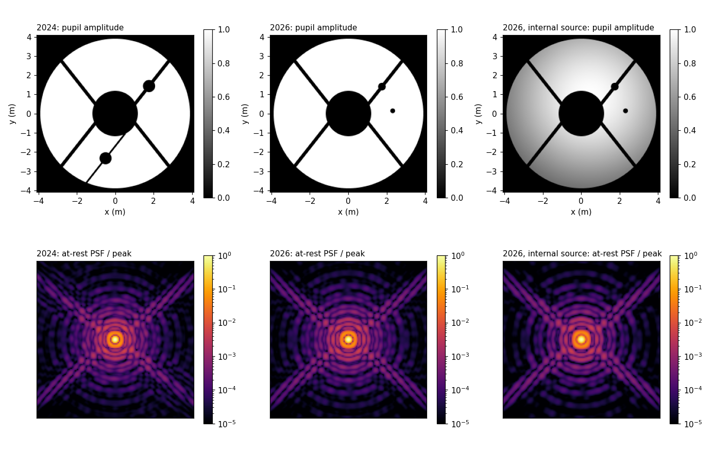

# SCExAO / VAMPIRES F750: the 2024 pupil model and a 2026 internal-source fit

> **Status: provisional.** The 2026 files describe the SCExAO pupil as
> inferred from focal-plane images taken on the internal calibration source.
> They have **not** been confirmed by the instrument team. If you know the
> bench and something here is wrong, please open an issue or tell Ian
> Cunnyngham.

This folder holds [telescope-sim](../../README.md) configurations of
VAMPIRES in the F750 (750-50) filter with no coronagraph, and the pupil
script each one uses. Nothing here is part of the installed package.

| File | What it is |
|---|---|
| `miles_pupil_2024.py` | Miles Lucas' 2024 SCExAO pupil script, unmodified. |
| `bench_pupil_2026.py` | The same script, edited to match the 2026 images. |
| `vampires_f750_2024.yaml` | The 2024 simulation configuration, using the 2024 pupil. |
| `vampires_f750_2026.yaml` | The same configuration with the 2026 pupil and plate scale. |
| `vampires_f750_bench_2026.yaml` | `vampires_f750_2026.yaml` plus the internal source's gaussian beam. |
| `render.py` | Builds all three, prints check values, draws the figure below. |



## What changed

The 2026 files are edits of the 2024 files, kept as small as possible so the
differences can be read directly:

```bash
git diff --no-index miles_pupil_2024.py bench_pupil_2026.py
git diff --no-index vampires_f750_2024.yaml vampires_f750_2026.yaml
git diff --no-index vampires_f750_2026.yaml vampires_f750_bench_2026.yaml
```

| Element | 2024 | 2026 (provisional) |
|---|---|---|
| Primary, secondary, four spiders | 7.79 m used of 7.92 m; spiders 0.1735 m wide from (±0.639, 0) m at 51.75° | unchanged |
| Dead-actuator masks | two, 0.632 m across, at (1.765, 1.431) m and (−0.498, −2.331) m | **one, 0.40 m across, at (1.74, 1.40) m**, on the first-quadrant spider |
| Support spider of the second mask | 0.089 m wide, from (0.521, −1.045) m | **removed** |
| Defect in the open pupil | none | **one opaque disc, 0.25 m across, at (2.30, 0.14) m** |
| Plate scale | 6.000 mas/px | **5.735 mas/px** |
| Band | 748 nm, 48 nm wide, five wavelengths 724–772 nm | unchanged |

Coordinates are metres on the primary, x right and y up, in the frame of the
2024 script.

## The internal source's beam

On the internal source the pupil is not evenly lit. The images fit a
gaussian beam: amplitude exp(−q/2·|r − r₀|²), with q = 0.073 m⁻² and
r₀ = (0.44, 0.79) m.

This belongs to the source, not to the pupil. It changed between dates, and
it presumably does not apply on sky. It is therefore **off by default** in
`bench_pupil_2026.py` and absent from `vampires_f750_2026.yaml`.
`vampires_f750_bench_2026.yaml` switches it on with two lines (`illum_q`,
`illum_offset`), for matching internal-source images.

## Where the 2026 values come from

A differentiable forward model was fitted to VAMPIRES focal-plane images of
the internal source on three dates in 2026 (08-28, 09-15 and 10-02). The
three fits agree with each other and with one pupil-camera image on the
points in the table. Ranges across the three dates:

- plate scale 5.734–5.736 mas/px at 748 nm, with the pupil diameter held at
  7.79 m;
- beam q = 0.065–0.073 m⁻²;
- beam centre r₀ = (0.70, 1.19), (0.40, 1.18), (0.44, 0.79) m. The files
  carry the last.

## What to keep in mind

- **Half turn.** Focal-plane images fix the feature positions only up to a
  rotation of everything together by 180°.
- **Amplitude only.** The images fit the defect equally well as a ~0.7 µm
  optical-path bump (a stuck actuator). The script can only make it opaque.
- **With the beam on, the aperture is an amplitude, not a mask.** The pupil
  values then run from 0 to just under 1. Anything that treats the aperture
  as binary — a collecting area, a photon budget — needs care. The beam
  centre is a nuisance parameter, not a constant.
- **This is not a full bench model.** It carries the pupil and the plate
  scale. It has no deformable mirror (the corrector is an ideal Zernike
  surface), no static aberration, no halo, and no detector noise.

## Use

The configs name their pupil script by a path relative to this folder, so
run from here (or make the `module:` path absolute):

```python
from telescope_sim import TelescopeSim

sim = TelescopeSim.from_yaml("vampires_f750_2026.yaml")   # or backend="jax"
out = sim.sample({"zernike_dm": coefficients})   # 35 values, Noll 2-36
psf = out["images"]["psf"]                       # (128, 128, 1), scaled to [0, 1]
```

One unit on a Zernike coefficient is 1 µm of peak mirror surface (2 µm of
peak optical path) on a mode normalised to a peak of 1 over a 7.79 m disc.

`python render.py` prints these values; a second machine should reproduce
them (telescope-sim 2.3.3, hcipy 0.7.0):

| Quantity | 2024 | 2026 | 2026, internal source |
|---|---|---|---|
| Σ amplitude × pixel area | 40.585076115561 m² | 41.226378527339 m² | 30.053048155215 m² |
| Lit pixels; maximum amplitude | 40,858; 1.0 | 41,364; 1.0 | 41,364; 0.99661853849 |
| Reference PSF peak | 1.29935516207e16 | 1.35524678213e16 | 7.2670392292e15 |
| Reference PSF sum | 2.33193454690e17 | 2.59865031225e17 | 1.43245616943e17 |
| 0.1 of x tilt: peak pixel; peak Strehl | (63, 65); 0.2317436399 | (63, 65); 0.6838234880 | (63, 65); 0.7039697655 |

The at-rest PSF peak is shared by four pixels, and the peak Strehl is read
at whichever of them is largest in the reference; that choice differs
between the configurations, which is why the tilt row differs so much.

With `actuators=False, defect=False`, `bench_pupil_2026.py` returns exactly
what `miles_pupil_2024.py` returns with `actuators=False`.

## Credit

The 2024 pupil script, and with it the primary, secondary and spider
geometry used in both years, is Miles Lucas' work, as is the measurement of
the 750-50 filter curve that sets the band.
